<>Halaman <b>Berita & Artikel</b> merupakan halaman admin yang berfungsi untuk mengelola berita dan artikal atau postingan yang akan tampil di halaman Berita & Artikel yang terdapat pada website [Darul Quran Aceh](https:dqa.sch.id/berita-dan-artikel). Halaman ini secara umum terlihat seperti pada gambar di bawah.</> 

 

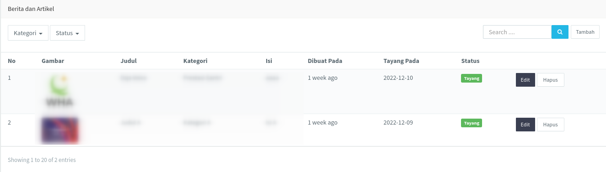  

### 1. Kategori

<b>Kategori</b> berfungsi untuk mengelompokkan artikel ke dalam beberapa kelompok tergantung berapa banyak kategori yang akan di tambahkan oleh admin. Secara <i>default</i> kategori berjumlah nol atau tidak terdapat kategori, sehingga sebelum menambahkan berita atau artikel admin harus terlebih dahulu menambahkan kategori minimal satu buah kategori. Namun apabila admin lupa menambahkan kategori dan langsung menambahkan berita atau artikel maka admin akan di arahkan untuk menambahkan kategori, seperti yang dapat dilihat pada gambar di bawah ini.

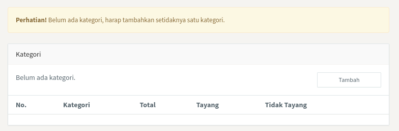

<>Untuk menambahkan kategori langsung klik <i>Tambah</i> seperti pada gambar di atas, maka akan muncul form untuk menambahkan kategori seperti gambar di bawah.</> 

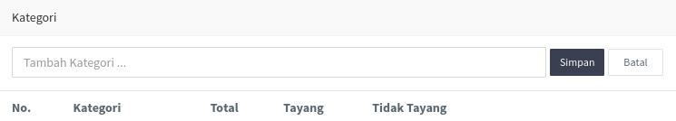

<>Tuliskan nama kategori yang diinginkan pada kolom yang tersedia seperti pada gambar di atas, kemudian klik <i>Simpan</i>. Apabila terdapat salah tulis nama kategori maka admin dapat mengubahnya dengan mengklik tombol <i>Edit</i> pada tabel kategori yang baru saja ditambahkan.</> 

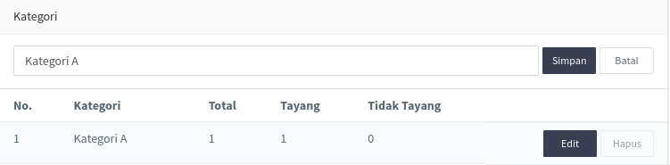

<>Bila sudah selesai kemudian klik Simpan. Setelah <b>Kategori</b> berhasil ditambahkan maka admin dapat menambahkan Berita ataupun Artikel pada halaman Berita dan Artikel.</> 

 

### 2. Tambah berita dan artikel

Admin dapat menambahkan <b>Berita dan Artikel</b> dengan mengklik tombol <i>Tambah</i> pada sudut kanan atas, selanjutnya akan muncul halaman seperti pada gambar di bawah ini.

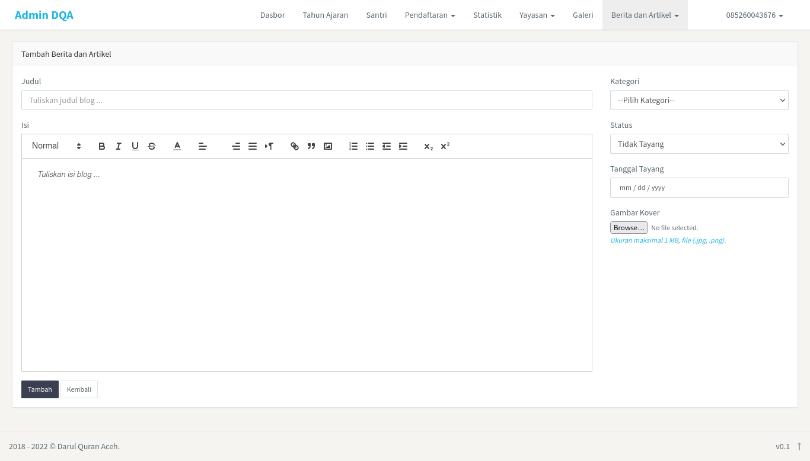

<>Berdasarkan gambar di atas kita dapat melihat ada beberapa kolom yang dapat di atur. Berikut penjelasan lebih lanjut.</> 
1. Judul, admin dapat mengisikan kolom dengan judul dari artikel atau berita yang diinginkan. Kolom ini wajib diisi, jika tidak diisi maka tidak dapat disimpan.
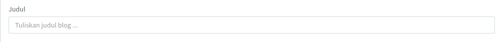

2. Isi, kolom isi dapat diisikan dengan keterangan ataupun penjelasan dari artikel atau berita yang ingin di publikasikan. Bagian ini juga terdapat pengaturan untuk <i>styling</i> dari tulisan, seperti mengatur teks, membuat penomoran, dan lain-lain.
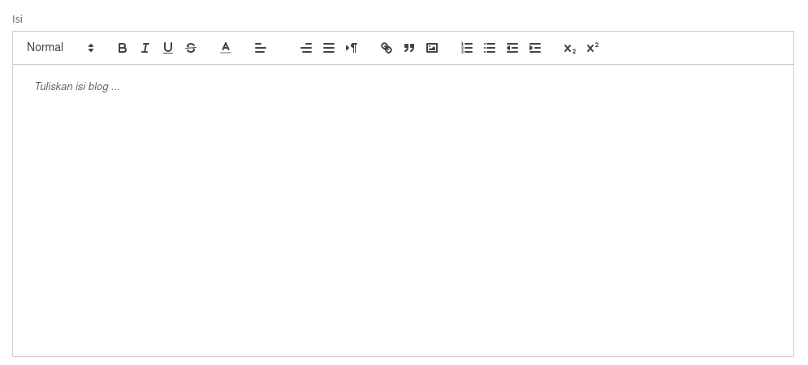

3. Pengaturan, bagian ini terdiri dari kategori, status penayangan, dan tanggal penayangan. Admin diwajibkan untuk memilih salah satu dari kategori. Status penyangan merupakan pilihan untuk menetapkan berita atau artikel untuk ditayangkan atau tidak ditayangkan. Selanjutnya juga ada tanggal penayangan, tanggal dan status penayangan bekerja secara bersamaan. Misal, admin menetapkan status penayangan sebagai tayang namun tanggal penayangan ditetapkan pada masa akan datang maka berita atau artikel tersebut juga tidak akan tanyang. Begitupun sebaliknya apabila admin menetapkan tanggal penayangan hari ini atau kemarin sementara status penayangan ditetapkan sebagai tidak tayang maka berita atau artikel tersebut juga tidak akan tayang.
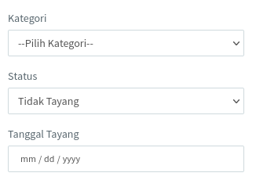

4. Menambahkan foto kover, foto ini akan muncul sebagai kover dari berita atau artikel pada halaman utama berita dan artikel dan akan muncul sebagai gambar utama pada halaman individual berita dan artikel. Admin dapat mengupload foto melaui kolom yang terdapat di bawah pengaturan.
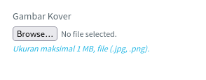

5. Menyimpan berita dan artikel, apabila semua kolom sudah diisi dan dipilih admin dapat menyimpan berita dan artikel dengan mengklik tombol Tambah.
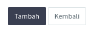

 

### 3. Ubah berita dan artikel

Setelah berhasil menambahkan berita dan artikel admin dapat mengubahnya pada halaman ini juga dengan mengklik tombol <i>Edit</i> pada tabel daftar berita dan artikel. Selanjutnya akan muncul halaman untuk mengedit berita dan artikel, halaman ini sama dengan halaman tambah artikel yang berbeda hanya pada tombol Simpannya saja. Jika sudah selesai mengubah artikel admin dapat mengklik tombol Simpan untuk menyimpan perubahan yang telah dilakukan.
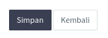

 

### 4. Hapus berita dan artikel

Admin dapat menghapus berita dan artikel yang tidak diperlukan lagi dengan mengklik tombol Hapus yang terletak disamping tombol <i>Edit</i>. Kemudian klik <i>Ok</i> untuk mengonfirmasi penghapusan berita dan artikel.
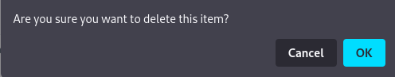

 

### 5. Filter

Admin dapat menyaring berita dan artikel yang terdapat di dalam tabel berdasarkan status penayangan dan kategori.

1. Status penayangan, admin dapat menyaring berdasarkan status dengan mengklik filter seperti gambar di bawah.
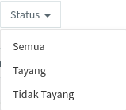

2. Kategori, sama halnya dengan status penayangan, admin dapat menyaring berdasarkan kategori seperti gambar di bawah.
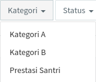

3. Selain dari filter admin juga dapat menyaring berita dan artikel dengan kata kunci tertentu dengan memanfaatkan kolom pencarian. Admin mengetikkan kata kunci tertentu kemudian klik tombol kaca pembesar maka akan tampil berita dan artikel sesuai denga kata kunci yang dimasukkan.
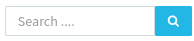
