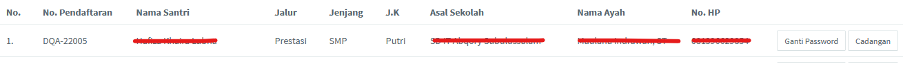
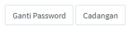
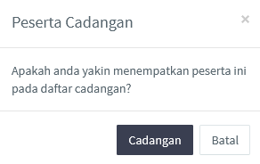
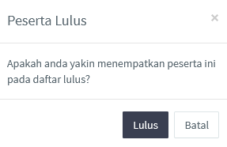

<>Fitur ini mengelola seleksi santri baik santri cadangan maupun santri lulus, hingga mengelola daftar ulang santri. Berikut penjelasan lebih lanjut mengenai fitur ini.</> 

 

### 1. Peserta lulus

Sama halnya seperti tabel-tabel yang terdapat ada halaman lainnya, halaman ini menampilkan tabel dari santri yang telah dinyatakan lulus oleh admin pada halaman [peserta tes](/peserta-tes). Tabel pada halaman ini seperti pada gambar di bawah.

 

Halaman <b>Peserta Lulus</b> terdapat dua buah tombol, yaitu <i>ganti password</i> dan <i>cadangan</i> seperti yang dapat dilihat pada gambar di bawah. Sesuai dengan namanya, tombol password berfungsi untuk mengganti password dan tombol cadangan untuk memindahkan santri tersebut ke dalam daftar santri cadangan.

 

Apabila admin mengklik tombol cadangan maka admin akan diminta persetujuan untuk mencadangkan santri tersebut. Jika sudah yakin langsung klik cadangan seperti pada gambar di bawah.

 

### 2. Peserta cadangan

Halaman ini sama dengan halaman peserta lulus, namun halaman ini hanya terdapat satu tombol saja yaitu tombol lulus. Tombol lulus ini berfungsi untuk menggati status dari santri cadangan menjadi santri yang lulus. Admin akan diminta persetujuan untuk meluluskan santri tersebut, bila sudah yakin langsung klik lulus seperti pada gambar di bawah.

 

### 3. Daftar ulang

Halaman <b>Darftar Ulang</b> hanya berisi daftar dari peserta yang telah melakukan daftar ulang.