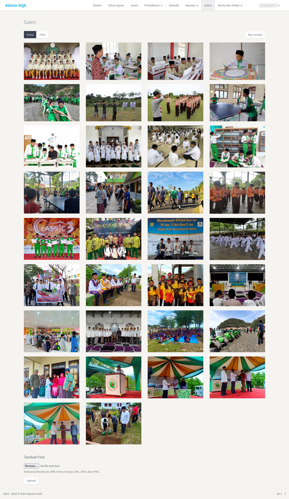
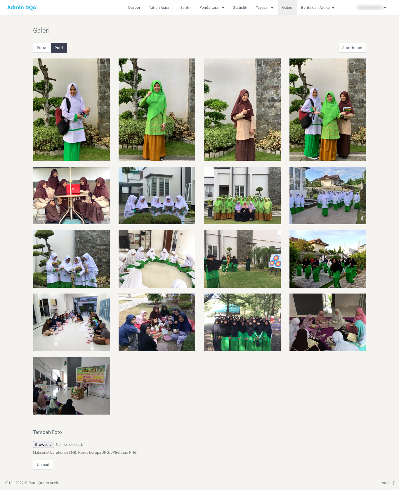
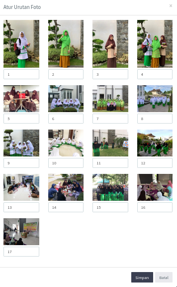
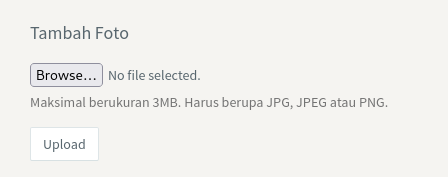

<>Halaman <b>galeri</b> merupakan halaman untuk meupload foto-foto santri. Pada halaman ini terdapat dua tampilan yaitu tampilan halaman putra dan tampilan halaman putri. Secara umum halaman ini seperti yang terlihat pada gambar di bawah ini.</> 

 

1. Halaman Putra

 

2. Halaman Putri

 

### 1. Ubah tampilan halaman

Mengubah tampilan halaman dapat dilakukan dengan mengklik pada tombol putra/putri seperti pada gambar di bawah.

 

### 2. Ubah urutan foto

Admin juga dapat mengubah urutan foto sesuai dengan kebutuhan dengan mengklik tombol <i>Atur Urutan</i> pada bagian sudut kanan atas. Sehingga akan muncul halaman seperti pada gambar di bawah.

 

 

Selanjutnya, admin hanya perlu mengetikkan nomor urutan sesuai dengan yang diinginkan pada kolom yang telah tersedia seperti yang dapat dilihat pada gambar di atas. Apabila sudah selesai langsung klik <i>Simpan</i> untuk menyimpan perubahan urutan foto.

 

### 3. Menambahkan foto

Selain dari itu, admin juga bisa menambahkan foto-foto baru pada bagian Tambah Foto yang terdapat di bagian bawah galeri atau seperti yang terlihat pada gambar di bawah.

 

 

Admin dapat menambahkan foto dengan mimilih file yang akan di upload melalui tombol <i>Browse</i>, setelah memilih foto langsung klik <i>Upload</i>. Ukuran foto dapat disesuaikan dengan ukuran foto yang telah terdapat di galeri.