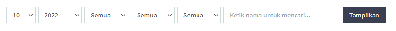
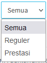
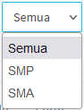
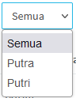

<><b>Bagian Admin</b> dari [Website DQA](https://dqa.sch.id) terdapat beberapa fitur lain-lain, seperti filter untuk menyaring isi dari tabel, search/pencarian untuk melakukan pencarian pada bagian admin, dan pagination untuk membagi tabel menjadi beberapa halaman.</> 

 

### 1. Filter

Beberapa halaman dari bagian admin terdapat filter untuk menyaring isi tabel/daftar santri, filter seperti pada gambar di bawah.

 

Terdapat enam bagian dari filter tersebut, secara berurut dari kiri ke kanan terdapat jumlah baris, tahun, jalur, jenjang, jenis kelamin, dan kata kunci (berupa nama dari santri). Selanjutnya pada bagian paling kanan terdapat tombol <i>Tampilkan</i> yang berfungsi untuk menjalankan fungsi dari filter yang telah kita tentukan.

 
 
 

### 2. Search/Pencarian

Fitur pencarian berfungsi untuk melakukan pencarian pada bagian tertentu. Misalnya pencarian pada bagian Berita dan Artikel, maka pencarian ini akan melakukan pencarian terhadap Berita dan Artikel. Begitu juga pada bagian lainnya, selain itu fitur pencarian juga terdapat pada fitur filter. Selain melakukan filter, filter yang terdapat pencarian juga akan menyaring hasil filter berdasarkan kata kunci yang diinputkan pada bagian pencarian.

 

### 3. Pagination

Pagination ini akan membagi tabel menjadi beberapa halaman, sehingga akan memudahkan dalam melihat daftar-daftar yang terdapat pada bagian admin. Misalnya ingin melihat daftar peserta tes, admin dapat berpindah halaman tabel dengan mengklik nomor-nomor yang terdapat pada bagian kanan bawah dari tabel.

