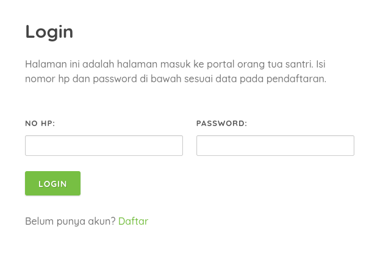
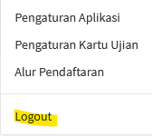

Log masuk, Gabung, atau Masuk (bahasa Inggris: <em>login</em>, juga biasa disebut sebagai <em>log in, log on, logon, signon, sign on, signin, sign in</em>) adalah proses untuk mengakses komputer dengan memasukkan identitas dari akun pengguna dan kata sandi guna mendapatkan hak akses menggunakan sumber daya komputer tujuan [(<b>Wikipedia</b>)](https://id.wikipedia.org/wiki/Log_masuk).

Definisi lain login adalah menu yang digunakan untuk masuk ke dalam sebuah aplikasi atau sebuah web. Jika Anda sudah melakukan proses <i>sign up</i> atau pendaftaran pada halaman [<b>Daftar</b>](https://dqa.sch.id/pendaftaran), maka Anda bisa masuk ke aplikasi atau website dengan cara memasukan email atau nomor handphone pada kolom <b>NO HP</b>, dan memasukan password pada kolom password.

### 1. Login ke halaman admin

Login ke halaman admin dapat dilakukan dengan mengunjungi halaman [<b>Login</b>](https://dqa.sch.id/login). Kemudian masukkan nomor handphone dan pasword seperti pada gambar di bawah ini.

Setelah berhasil <i>login</i> atau masuk Anda akan diarahkan ke halaman [<b>Dasbor</b>](/dasbor) pada bagian admin.

### 2. Logout dari halaman admin

Pada halaman admin Anda dapat melakukan <i>logout</i> melalui menu seperti pada gambar di bawah ini, yang terdapat pada bagian user/no hp.

