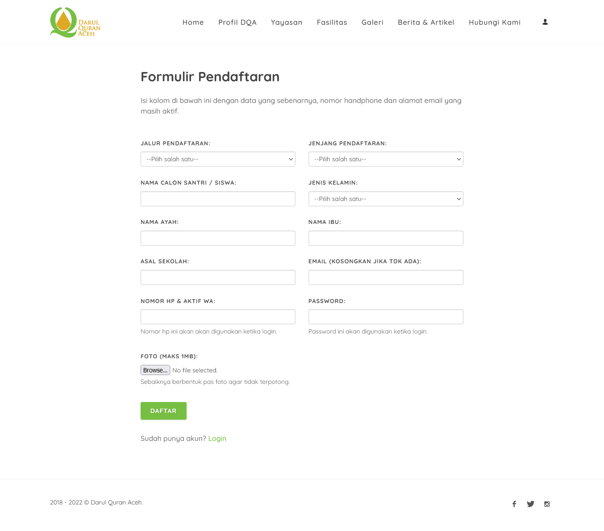
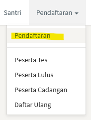
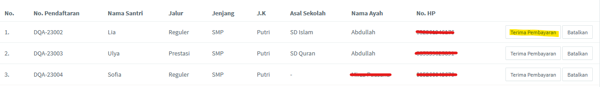
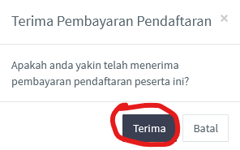
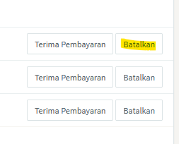

<b>Pendaftaran</b> merupakan fitur yang dapat mengelola proses pendaftaran santri baru. Berikut penjelasan lebih lanjut mengenai fitur ini.

 

### 1. Formulir

<b>Formulir</b> adalah bagian pertama dari seluruh proses pendaftaran. Bagian ini akan diisi oleh santri/wali santri yang akan mendaftar sebagai siswa baru. Terdapat beberapa isian pada formulir ini, seperti yang terlihat pada gambar di bawah ini.

 

Formulir terdiri dari jalur pendaftaran (prestasi/reguler), jenjang pendaftaran (SMP/SMA), nama calon siswa/santri, jenis kelamin, nama ayah, nama ibu, asal sekolah, email, nomor hp, password, dan foto.

 

### 2. Terima pembayaran

Setelah santri/wali santri selesai melakukan pendaftaran, maka santri tersebut akan masuk pada tabel yang terdapat pada menu pendaftaran di halaman admin. Halaman ini dapat di akses dengan cara sebagai berikut.

 

Setelah berhasil mengakses halaman tersebut maka admin akan melihat tabel seperti gambar di bawah.

 

Tabel ini terdapat dua buah tombol, yaitu <i>Terima Pembayaran</i> dan <i>Batalkan</i>. Apabila admin ingin mengonfirmasi pembayaran yang telah dilakukan oleh santri/wali santri, admin dapat mengklik tombol <b>Terima Pembayaran</b>. Selanjutnya, akan keluar pernyataan kepastian penerimaan pembayaran, apabila sudah yakin langsung klik tombol <b>Terima</b> seperti pada gambar di bawah.

 

Setelah berhasil melakukan konfirmasi Terima Pembayaran santri tersebut akan dipindahkan ke table peserta pada halaman [peserta tes](/peserta-tes/).

 

### 3. Batalkan

Selain dari tombol <i>Terima Pembayaran</i> tabel di atas juga terdapat tombol <b>Batalkan</b> yang berfungsi untuk membatalkan pendaftaran yang dilakukan oleh santri/wali santri.

 