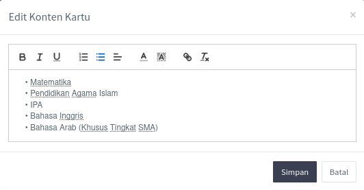

<>Halaman <b>pengaturan</b> terdiri dari tiga bagian, yaitu pengaturan aplikasi, pengaturan kartu ujian, dan pengaturan alur pendaftaran. Pengaturan dapat diakses melalui menu yang tertera nomor <i>handphone</i> admin. Masing-masing bagian memiliki fungsinya masing-masing, penjelasan lebih lanjut sebagai berikut:</> 

 

 

### 1. Pengaturan aplikasi

Pengaturan bagian ini mengelola judul, alamat, nomor whatsapp notifikasi pendaftaran santri, alamat facebook dan instagram, kode google analitik, info pendaftaran pada halaman utama, dan panduan pendaftaran pada halaman panduan pendaftaran.

<>Admin dapat mengubah semua informasi tersebut dengan mengklik tombol Ubah Pengaturan yang terdapat pada sudut kiri bawah halaman pengaturan aplikasi.</> 

<>Selanjutnya, ubah setiap bagian yang diperlukan kemudian klik tombol Simpan.</> 

 

### 2. Pengaturan kartu ujian

Kartu ujian terbagi pada dua model, yaitu kartu ujian jalur prestasi dan kartu ujian jalur reguler. Secara umum kartu ujian terdiri dari judul yang terletak pada bagian atas, foto santri yang terletak ada bagian kiri, nama santri yang terletak di bawah foto, nomor ujian yang terletak di sudut kanan atas. Perbedaan di antara keduanya terdapat pada isi dari kartu ujian.

1. Kartu ujian jalur prestasi, isi dari kartu ini terdiri dari jadwal tes, jadwal pendaftaran jalur reguler, dan tanggal pengumuman jalur prestasi;

2. Kartu ujian jalur reguler, isi dari kartu ini terdiri dari materi ujian dan jadwal tes.

Admin dapat mengubah setiap bagian isi dengan mengklik pada bagian yang ingin di ubah. Misalnya bagian materi ujian pada jalur reguler. Ubah sesuai dengan yang diinginkan kemudian klik Simpan.

 

### 3. Pengaturan alur pendaftaran

Alur pendaftaran akan tampil pada halaman panduan pendaftaran. Alur ini akan menjelaskan secara grafis urutan-urutan dari pendaftaran santri. Admin dapat mengelola alur ini dengan mengklik tombol Tambah Alur. Apabila terdapat perubahan admin dapat menghapus dan menambah alur baru. Ketika menambah alur admin harus menentukan nomor dari urutan alur dan keterangan dari alur pendaftaran.

1. Tambah Alur, isikan urutan alur pada kolom Urutan dan keterangan pada kolom Keterangan. Kolom Keterangan ini dapat ditambahkan [tag HTML](https://www.w3schools.com/tags/tag_br.asp) sesuai yang diiginkan.

2. Hapus Alur

