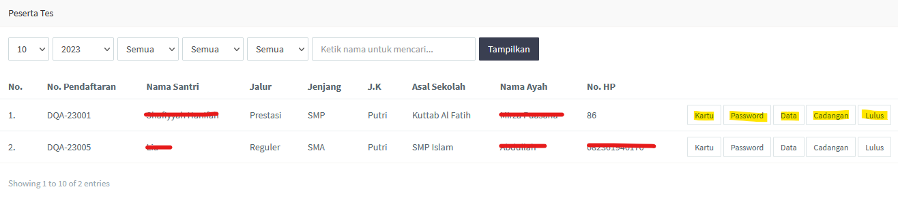
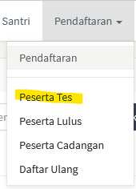
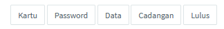
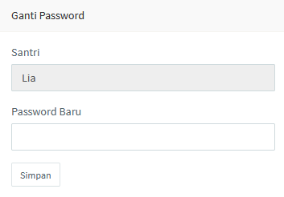
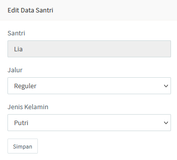

<>Halaman ini akan menampilkan santri-santri yang telah berhasil dikonfirmasi pembayaran pada halaman [pendaftaran](/pendaftaran). Halaman <b>Peserta Tes</b> terdapat dapat seperti gambar di bawah.</> 

 

 

<>Halaman ini dapat di akses pada menu seperti gambar di bawah.</> 

 

 

### Tombol halaman peserta tes

<>Tabel pada halaman ini terdapat lima buah tombol, yaitu kartu, password, data, cadangan, dan lulus. Seperti pada gambar di bawah.</> 

 

 

Masing-masing tombol ini memiliki fungsinya masing-masing. 
1. Tombol <b>kartu</b> berfungsi untuk melihat informasi kartu ujian tiap-tiap santri. 
2. Tombol <b>password</b> berfungsi untuk mengubah password dari tiap-tiap santri. 
3. Tombol <b>data</b> berfungsi untuk mengubah data tiap-tiap santri. 
4. Tombol <b>cadangan</b> berfungsi untuk menetapkan santri tersebut sebagai santri cadangan. 
5. Tombol <b>lulus</b> sama halnya seperti tombol cadangan namun tombol ini untuk menetapkan santri tersebut sebagai santri yang lulus tes.

 

Apabila admin menetapkan santri tertentu sebagai cadangan maupun sebagai lulus maka santri tersebut akan dipindahkan pada tabel yang terdapat pada [halamannya masing-masing](/peserta-lulus-cadangan-dan-daftar-ulang), cadangan akan dipindahkan pada halaman <i>Peserta Cadangan</i> dan lulus akan dipindahkan pada halaman <i>Peserta Lulus</i>.