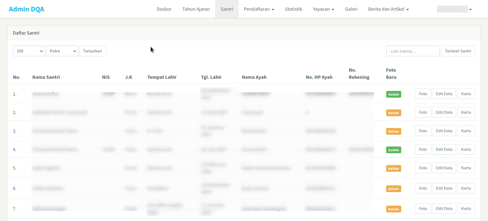
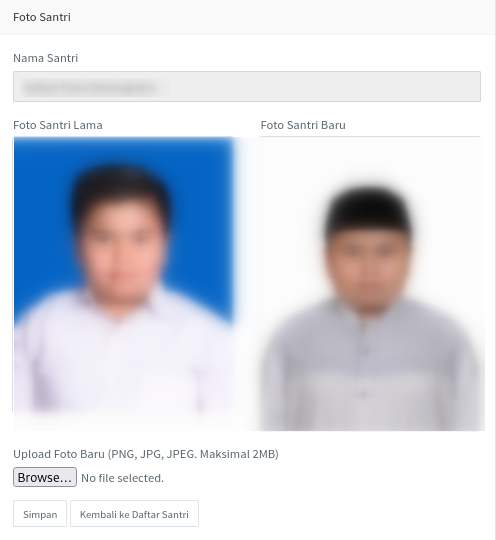
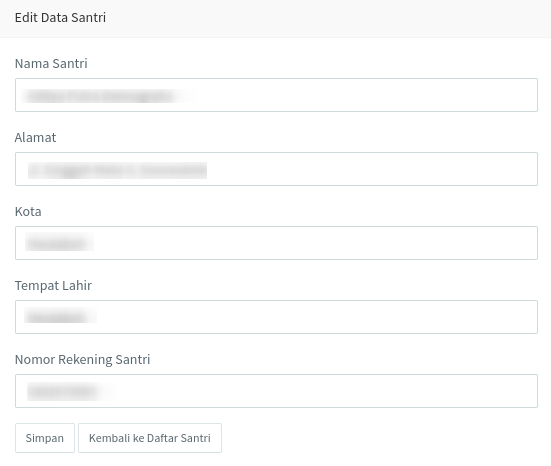
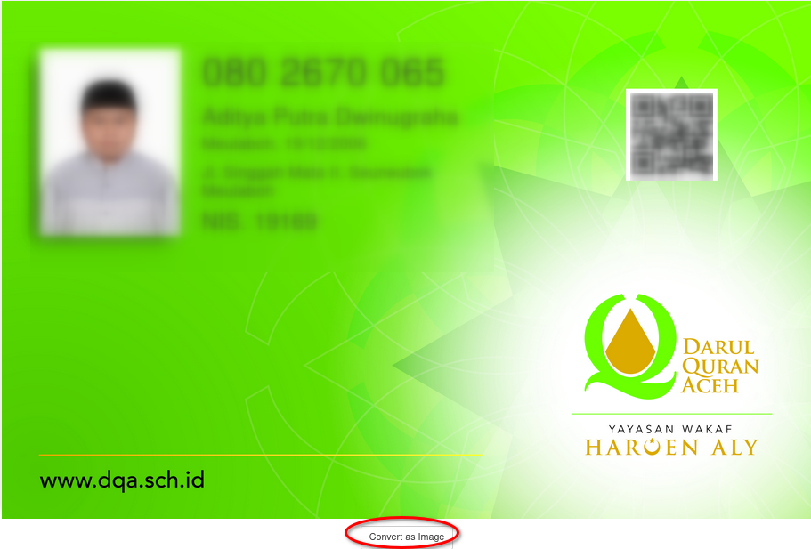
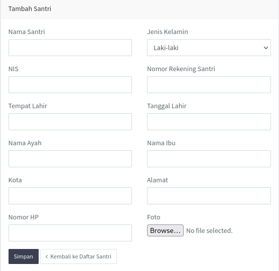

<>Halaman <b>santri</b> menampilkan daftar seluruh santri dari Darul Quran Aceh dalam bentuk tabel. Tabel tersebut berisi informasi seperti nama santri, nomor induk, jenis kelamin, tempat lahir, taggal lahir, nama ayah, nomor handphone ayah, nomor rekening, dan status foto. Semua informasi tersebut seperti yang dapat dilihat seperti pada gambar di bawah ini.</> 

 

 

### Tombol halaman santri

Halaman santri terdapat beberapa tombol, yaitu tombol foto, edit data, dan kartu. Seperti gambar di bawah ini.

 

Selain tiga tombol yang disebutkan di atas juga terdapat satu tombol lagi di bagian sudut kanan atas, yaitu tombol <i>Tambah Santri</i>. Masing-masing dari tombol tersebut memiliki fungsinya masing-masing yang dijelaskan sebagai berikut:
1. Tombol <b>foto</b> berfungsi untuk melihat informasi foto lama dan foto baru santri dan juga dapat menambah foto baru santri. Foto tersebut yang akan ditampilkan ada bagitan kartu santri. Tombol ini akan menampilkan halaman seperti pada gambar di bawah.

 

2. Tombol <b>edit data</b> berfungsi untuk mengubah informasi santri, dimana data-data tersebut akan tampil pada kartu santri. Tombol ini akan menampilkan halaman seperti gambar di bawah.

 

3. Tombol <b>kartu</b> berfungsi untuk menampilkan kartu dari santri yang dipilih. Selain menampilkan informasi kartu, halaman yang ditampilkan oleh tombol ini juga terdapat tombol lainnya di dalamnya seperti yang terlihat pada gambar di bawah. Tombol tersebut berfungsi untuk mengubah halaman tersebut menjadi image yang dapat dicetak menjadi <i>print out</i> kartu santri.

 

4. Seperti dijelaskan sebelumnya halaman ini juga terdapat satu tombol lagi, yaitu tombol <b>Tambah Santri</b>. Sesuai dengan namanya tombol ini berfungsi untuk menambah santri ke dalam daftar santri. Tombol ini menampilkan halaman seperti pada gambar di bawah.

 