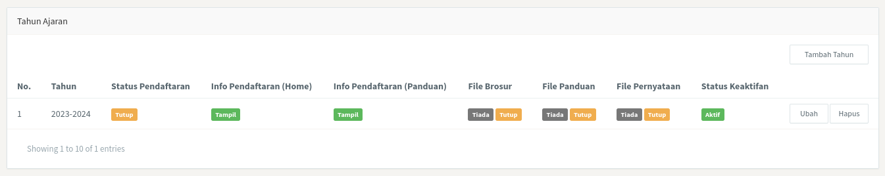
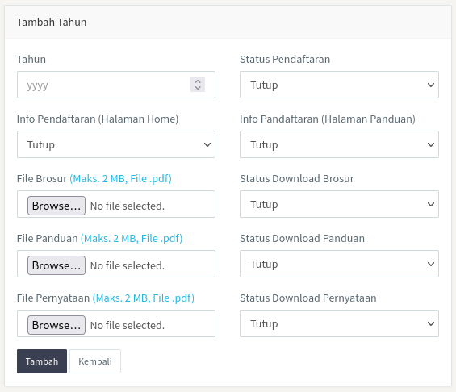
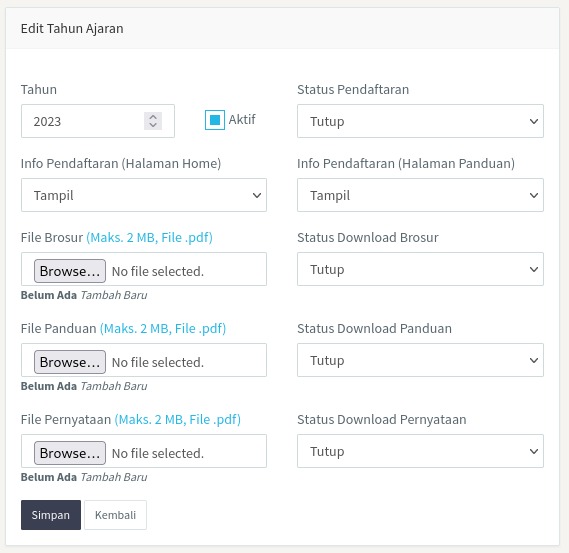

### 1. Pendahuluan

Halaman <b>Tahun Ajaran</b> berisi tentang pengelolaan tahun ajaran, baik tahun ajaran yang sedang berjalan maupun tahun ajaran yang telah lalu. Pada halaman ini admin dapat melakukan aktif/nonaktif tahun ajaran yang sedang berjalan. Pada halaman ini terdapat kolom tahun, status pendaftaran, info pendaftaran (<i>home</i>), info pendaftaran (panduan), file brosur, file panduan, file pernyataan, dan status keaftifan. Selengkapnya, seperti pada gambar di bawah ini.

 

Kolom tahun menunjukkan tahun dari tahun ajaran; kolom status pendaftaran menunjukkan status keaftifan dari halaman formulir pendaftaran; kolom info pendaftaran (<i>home</i>) menunjukkan status keaftifan dari info pendaftaran yang terdapat pada halaman utama website DQA; kolom info pendaftaran (panduan) menunjukkan status keaftifan dari info pendaftaran yang terdapat pada halaman panduan pendaftaran; kolom file brosur, kolom file panduan, dan kolom file pernyataan menunjukkan dua hal yaitu, ada atau tidak adanya file tertentu dan akfif atau tidak aktifnya tombol download dari file tersebut; kolom keaftifan menunjukkan status keaftifan dari tahun ajaran tertentu. Tahun Ajaran hanya dapat diaktifkan salah satu, bila ingin mengaktifkan Tahun Ajaran yang lain dari yang sedang aktif, maka Tahun Ajaran yang sedang aktif harus dinonaktifkan terlebih dahulu.

 

### 2. Tambah tahun

Menu <b>Tambah Tahun</b> berfungsi untuk melakukan penambahan tahun ajaran baru. Menu ini terdapat pada bagian sudut kanan atas dari halaman utama Tahun Ajaran, seperti yang dapat dilihat pada gambar di atas. Pada halaman ini terdapat kolom tahun, status pendaftaran, info pendaftaran (halaman <i>home</i>), info pendaftaran (halaman panduan), file brosur, file panduan, file pernyataan, status download brosur, status download panduan, dan status download pernyataan. Lebih jelasnya dapat dilihat pada gambar di bawah ini.

 

Admin dapat menambahkan tahun ajaran dari tahun semester ganjilnya saja karena tahun semester genapnya akan otomatis ditambahkan. Misalnya ...

 

<i>"Admin ingin menambahkan tahun ajaran 2023-2024, maka admin hanya perlu menuliskan tahun 2023 dan tahun 2024 akan secara otomatis ditambahkan."</i>

  

Admin dapat menambahkan file sesuai kolom masing-masing seperti yang terlihat pada gambar di atas. Semua menu pilihan secara <i>default</i> terdapat pada pilihan tutup, admin dapat mengubahnya menjadi tampil sesuai dengan kebutuhan. Selanjutnya, apabila semuanya dirasa sudah sesuai langsung klik tombol <b>Tambah</b> pada bagian kiri bawah.

 

### 3. Ubah tahun

Menu <b>Ubah</b> pada tahun ajaran berfungsi untuk mengubah/<i>edit</i> tahun ajaran. Menu ubah juga berfungsi untuk mengganti file-file terkait. Sama halnya dengan menu tambah menu ini juga berisi kolom-kolom yang sama dengan menu tambah, hanya saja pada menu ini terdapat pengaturan untuk mengaktifkan atau menonaktifkan tahun ajaran yang secara <i>default</i> diatur sebagai tidak aktif dan terletak disebelah kanan tahun. Seperti yang terlihat pada gambar di bawah ini.

 

### 4. Hapus tahun

Menu ini berfungsi sesuai dengan namanya, yaitu untuk menghapus tahun ajaran yang telah ditambahkan.
